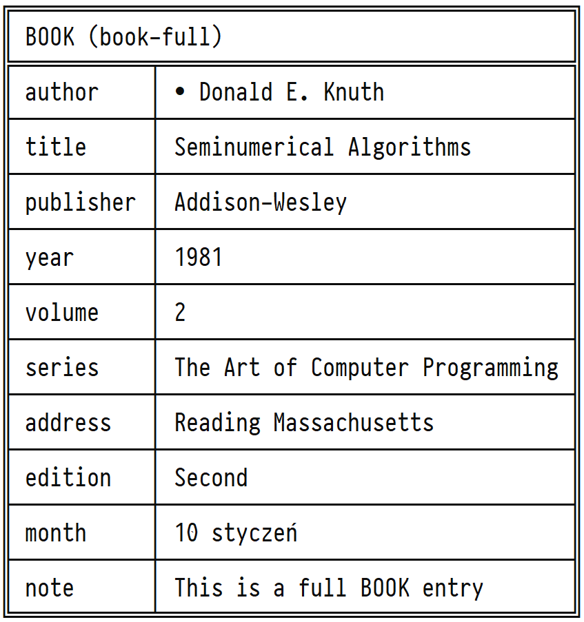

<h1 align="center">BibTeX parser</h1>
<p align="center">
    Simple
    <a href="https://www.ctan.org/pkg/bibtex">BibTeX</a>
    parser written in
    <a href="https://www.java.com">Java</a>.
</p>
<p align="center">
    <a href="https://www.ctan.org/pkg/bibtex">
        
    </a>&nbsp;&nbsp;&nbsp;&nbsp;&nbsp;
    <a href="https://www.java.com">
        
    </a>
</p>


## Usage

```bash
java -jar bibtex-parser.jar -f <file> -t <type1,type2,...> -a <author1,author2,...>
```


## Example

```bash
java -jar bibtex-parser.jar -f example.bib -t book -a Knuth
```


